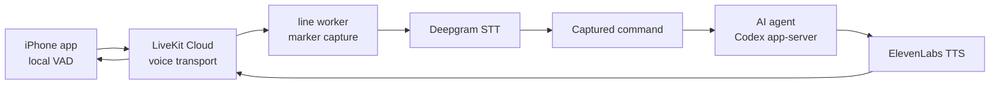

# line

> **Archived:** line is no longer under active development. After testing
> [Happy](https://github.com/slopus/happy), the intended product direction for
> line is considered covered by Happy's mobile/web agent control and voice
> workflow. See [ARCHIVED.md](ARCHIVED.md) for context.

line is a hands-free voice control layer for AI coding agents.

The first public release target is intentionally small: build the local gateway
and iOS app from source, pair your phone with your Mac, say a marker-gated
command, and receive a spoken result from a Codex app-server session.

## What works today

- Native iOS client with local energy VAD before audio leaves the phone.
- Local Python gateway for pairing invitations, LiveKit tokens, event logs, and
  voice worker orchestration.
- LiveKit Cloud transport.
- Deepgram speech-to-text and ElevenLabs text-to-speech.
- Marker capture mode: say `start command`, wait for the cue, speak the command, then
  say `send command`.
- Codex app-server backend with one active thread per worker session.

## Not yet

- Hosted SaaS or App Store distribution.
- Multi-agent routing UI.
- Fully local default speech stack.
- Hardened auth for untrusted networks.
- Fully renamed App Store-ready iOS product metadata.

## How it works



## Requirements

- macOS with Python 3.12 and `uv`
- Xcode 15+ and XcodeGen for the iOS app
- A physical iPhone or iOS simulator
- LiveKit Cloud project credentials
- Deepgram API key
- ElevenLabs API key
- Codex CLI with `app-server` support

## Quickstart

Follow the [gateway setup](gateway/README.md) to configure credentials, start
the local gateway, start the voice worker, and create a gateway invitation. Then
follow the [iOS client guide](clients/ios/README.md) to build the app, configure
local signing, and pair the phone.

After the phone connects, say:

```text
start command
Check the tests in this project and briefly report the result
send command
```

The worker sends only the captured command text to Codex, then speaks Codex
`reply_to_voice` updates and the final agent reply back through the LiveKit
room.

## Documentation

- [Archive notice](ARCHIVED.md)
- [Gateway setup](gateway/README.md)
- [iOS client](clients/ios/README.md)
- [Security model](SECURITY.md)
- [Advanced and experimental modes](docs/advanced.md)
- [CC channel bridge](bridges/cc-channel/README.md)

## Repository layout

```text
gateway/             Python package, CLI, local gateway API, and worker
clients/web/         Static browser client served by the local gateway API
clients/ios/         Source-built iOS client
bridges/cc-channel/  Experimental Claude Code channel bridge
docs/                Repository-wide advanced and experimental notes
```

Codex app-server support lives inside the Python gateway as an agent backend.
`bridges/` is for external sidecar adapters such as the Claude Code channel
bridge.

## Development

Gateway test commands live in [gateway/README.md](gateway/README.md). Optional
Claude Code channel bridge setup and tests live in
[bridges/cc-channel/README.md](bridges/cc-channel/README.md). The iOS project is
generated with XcodeGen from `clients/ios/project.yml`.

## License

MIT. See [LICENSE](LICENSE).
