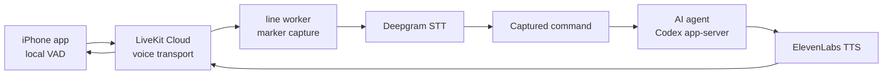

# line

line is a hands-free voice control layer for AI coding agents.

The first public release target is intentionally small: build the macOS server
and iOS app from source, pair your phone with your Mac, say a marker-gated
command, and receive a spoken result from a Codex app-server session.

## How it works



## What works today

- Native iOS client with local energy VAD before audio leaves the phone.
- Local macOS Python server for pairing, LiveKit tokens, event logs, and voice
  worker orchestration.
- LiveKit Cloud transport.
- Deepgram speech-to-text and ElevenLabs text-to-speech.
- Marker capture mode: say `start command`, wait for the cue, speak the command, then
  say `send command`.
- Codex app-server backend with one active thread per worker session.

## Not yet

- Hosted SaaS or App Store distribution.
- Multi-agent routing UI.
- Fully local default speech stack.
- Hardened auth for untrusted networks.
- Fully renamed App Store-ready iOS product metadata.

## Requirements

- macOS with Python 3.12 and `uv`
- Xcode 15+ and XcodeGen for the iOS app
- A physical iPhone or iOS simulator
- LiveKit Cloud project credentials
- Deepgram API key
- ElevenLabs API key
- Codex CLI with `app-server` support

## Quickstart

Install dependencies and run the local checks:

```bash
uv sync --all-extras --dev
cp .env.example .env
```

Fill `.env`, then run:

```bash
uv run line doctor --agent-backend codex-app-server --agent-cwd /path/to/workspace
uv run pytest -q
```

Start the local pairing/token server:

```bash
uv run line demo-server --host 0.0.0.0 --room line-dev --identity mac-test
```

Start the voice worker in another terminal:

```bash
uv run line lowlevel-worker \
  --room line-dev \
  --identity line-worker \
  --agent-backend codex-app-server \
  --agent-cwd /path/to/workspace \
  --capture-mode markers \
  --capture-start "start command" \
  --capture-submit "send command" \
  --capture-cancel "cancel"
```

Build and run the iOS app:

```bash
cd ios/Line
xcodegen generate
open Line.xcodeproj
```

Set your signing team and bundle identifier in ignored
`ios/Line/Line.local.xcconfig`, regenerate the Xcode project, then run the app
on your iPhone. Pair it with the local server:

```bash
uv run line pair --server-url http://YOUR-MAC-LAN-IP:8787
```

Enter the pairing code in the iOS app. After the phone connects, say:

```text
start command
Check the tests in this project and briefly report the result
send command
```

The worker sends only the captured command text to Codex, then speaks the final
agent reply back through the LiveKit room.

## Documentation

- [Server setup](docs/server-setup.md)
- [iOS build](docs/ios-build.md)
- [Security model](docs/security.md)
- [Advanced and experimental modes](docs/advanced.md)
- [Claude channel bridge](docs/claude-channel.md)

## Development

```bash
uv run pytest -q
cd channels/claude-voice-channel
bun test
```

The iOS project is generated with XcodeGen from
`ios/Line/project.yml`.

## License

MIT. See [LICENSE](LICENSE).
